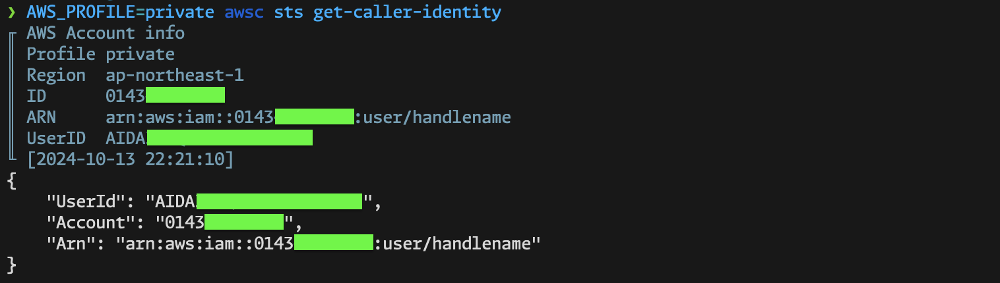

# awsc

awsc (AWS cli with Caution) is wrapper for [AWS CLI](https://aws.amazon.com/cli/?nc1=h_ls).
It displays AWS account information before running any AWS CLI subcommands.

## Synopsis

```console
$ awsc [args for AWS CLI]
```

## Example



## Installation

```console
$ brew install handlename/tap/awsc
```

Alternatively, download the binary from the [releases](https://github.com/handlename/awsc/releases) page.

## Configuration

### Configuration file path

You can customize awsc's behavior using a configuration file.
The search paths for the configuration file (in order of priority) are as follows:

- `$AWSC_CONFIG_PATH`
- `$XDG_CONFIG_PATH/awsc/config.yaml`
- `~/.config/awsc/config.yaml`
- `~/.awsc/config.yaml`

### Configuration file syntax

```yaml
# "rules" is a list of conditions for displaying caution.
# The first matched rule will be applied.
rules:
  - # "expression" is a regular expression to trigger caution.
    expression: '(production|pro?d)'
    # "color" specifies the caution's foreground color.
    # Available options: red, green, yellow, blue, magenta, cyan, white, black
    color: red
  - expression: '(staging|stg)'
    color: green
  - expression: '(development|dev|sandbox)'
    color: blue

# "template" defines the format of the caution message.
# If empty, the default template will be used.
# You can use Go's `text/template` syntax.
# Available variables:
# - .Profile: AWS profile name
# - .Region: AWS region
# - .ID: AWS account ID (requires "extra_info" to be true)
# - .UserID: AWS user ID (requires "extra_info" to be true)
# - .Arn: AWS ARN (requires "extra_info" to be true)
# - .Now: The timestamp when the command is executed, formatted by `time_format`
# Additionally, you can embed environment variables using `<< env "ENV_NAME" >>` or `<< must_env "ENV_NAME" >>`.
# See https://github.com/kayac/go-config for more details.
template: |-
  {{ .Now }} # {{ .Profile }} in {{ .Region }}

# "extra_info" determines whether to display extra information.
# If true, awsc makes one or more API calls to AWS to gather extra data.
extra_info: true

# "time_format" specifies the format for the timestamp in the caution message.
# It follows Go's `time.Format` syntax.
time_format: '15:04:05'
```

## Environment variables

var | description
---|---
`$AWSC_LOG_LEVEL` | Log level: `trace`, `debug`, `info`(default), `warn`, `error`, `panic`
`$AWSC_CONFIG_PATH` | Path to the configuration file.

## Lisence

MIT

## Author

@handlename
